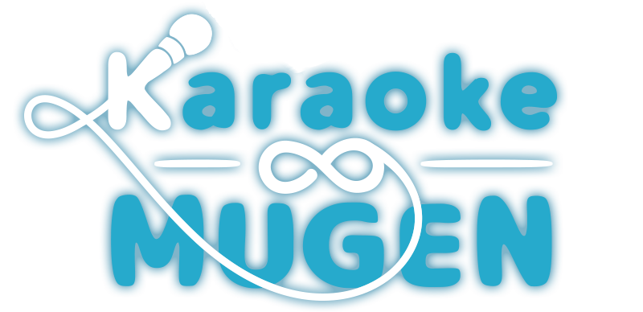

# Karaoke Mugen




Master branch : [](https://lab.shelter.moe/karaokemugen/karaokemugen-app/commits/master) -
Next branch : [](https://lab.shelter.moe/karaokemugen/karaokemugen-app/commits/next)

    

[Visit Karaoke Mugen's homepage](http://karaokes.moe)

Karaoke Mugen is a playlist manager and player for video karaoke. It's made of a webapp and an engine. The webapp allows users to add songs and admins to manage the karaoke session and playlists. The engine plays those songs on the computer used to display the video.

It works like a japanese karaoke where anyone can add songs one after another to a playlist with their smartphone, tablet or computer. Another mode allows users to add videos to a suggestion list the admin can then pick songs from.

Karaoke Mugen works offline and does not require an Internet connection.

## Features

* Can use single videos or videos + included subtitles.
* Works with .ass subtitles
* Skip, pause, play, stop, rewind playback from the webapp.
* Manage playlists, shuffle them, order them, copy songs from one to another, etc.
* Web interface for smartphone/tablet/PC ~~IE6 compatible~~
* Displays karaoke information at the beginning and end of song
* Tag/metadata system for karaokes : year, studio, singer, songwriter, language, etc.
* Keep track of who asked for this or that song.
* Public or private mode :
  * In private mode (default) songs added by users are directly played one after the other in the current playlist
  * In public mode, songs are added to a suggestion list. It's up to the admin to add songs from this list.
* Export/import playlists
* REST API so you can create custom clients or web interfaces.
* And many other things! Check out the [feature list](http://mugen.karaokes.moe/en/features.html)

## How it works

* See the install section below
* Place karaoke songs inside the `app/data` folder. See the [karaoke base repository](https://lab.shelter.moe/karaokemugen/karaokebase) and [documentation](http://mugen.karaokes.moe/docs/en/user-guide/manage/). If you don't want to add a full karaoke base for now, Karaoke Mugen will copy its samples in your `app/data` if it's left empty so you can try out the app.
* Launch the app (see the launch section below). It will open a browser on the welcome screen. Follow the guided tour for admins.
* Once your playlist is ready, invite some friends and direct them to the public interface with their device. Let them add songs. Once enough songs are added, hit play and have fun!

In the repository mentioned above, you'll find a karaoke songs database ready for use. Beware, it's about 190Gb big once the videos have been downloaded.

For more information, check out the [documentation site!](http://mugen.karaokes.moe/docs/en/)

## Install

If you don't want to install manually, binaries are available [on the website](http://mugen.karaokes.moe/en/download.html) for Windows and macOS. For Linux, follow the following steps.

### Download

To install, git clone this repository or download a copy as ZIP.

### Yarn

If you don't have `yarn`, install it first :

```sh
npm install -g yarn
```

or via your Linux distribution's package manager.

### Dependencies

Then launch `yarn` to install dependencies and build the React frontend.

```sh
yarn setup
```

### Launch

To launch the app :

```sh
yarn start
```

Generating a database ie required on first launch and is done automatically if the file `app/db/karas.sqlite3` is missing. You can trigger it manually later by connectiong to the admin panel from the welcome screen. Another way is to delete the `app/db/karas.sqlite3` and let the app regenerate it on startup or launch with the `--generate` command-line option.

On first run, the app will make you create an admin user and follow a guided tour of the control panel. You can trigger this tour/admin creation process again by adding `appFirstRun=1` to your config file.

## System requirements

The app is multi-platform and works on Linux/Windows/OSX.

It requires nodeJS 10.9 or above.

It also requires mpv and ffmpeg binaries (see below).

### Binaries

mpv (video player) and ffmpeg (video processing) are required by Karaoke Mugen

* mpv 0.25 or up for Windows/Linux, 0.27 or up required for macOS ([mpv's website](http://mpv.io))
* ffmpeg 3 or later ([ffmpeg's website](http://www.ffmpeg.org))

#### Windows/macOS

Binaries must be placed in the `app/bin` folder (create it if it doesn't exist already).

You can also specify paths where to find those binaries in your `config.ini` file if you have them already installed elsewhere on your system and wish to use them.

#### Linux

Make sure ffmpeg/mpv are available in `/usr/bin`. If that's not the case, modify those paths in `config.ini`

Linux distributions often package old versions of ffmpeg/mpv, update them first via their own websites' instructions.

## Translations

Currently french and english are supported. Translators are welcome!

## How to contribute

Read the [dedicated section on the documentation website](http://mugen.karaokes.moe/docs/en/dev-guide/code/)

Everything's there, and if you have questions, you can come to [our Discord](https://discord.gg/XFXCqzU) in the #karaoke_dev section!

## Credits

"Nanamin", Karaoke Mugen's mascott, is designed by [Sedeto](http://www.sedeto.fr)